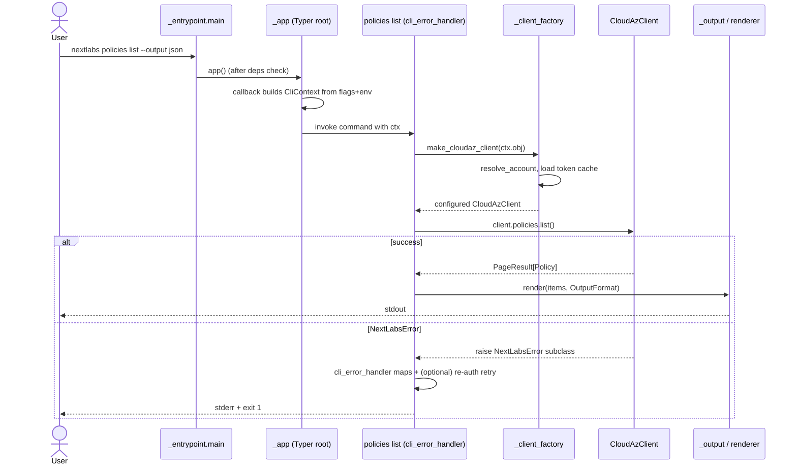

# CLI Blueprint

A pattern guide for building a Python CLI on top of a typed REST SDK.

This document describes the architecture, building blocks, and intended way
of working of the `nextlabs` CLI in this repository, written for someone who
wants to build a similar CLI for **a different SDK**. It assumes you are a
Python developer comfortable with [Typer](https://typer.tiangolo.com/) and
[httpx](https://www.python-httpx.org/) — we focus on patterns, not on tool
tutorials.

Each section names a pattern in domain-neutral terms, then shows the
NextLabs implementation as a worked example. NextLabs-specific features
(dual API surface, multi-account selection, OIDC `id_token`-as-bearer) are
flagged so you can skip them when they don't fit your SDK.

The internal `docs/architecture.md` is the authoritative module map; this
document is its outward-facing sibling.

---

## 1. Layering & boundaries

**Pattern.** The CLI is just another consumer of the SDK's public API. It
imports only from the package's public surface — never from underscore
modules. This keeps the CLI from becoming a backdoor into SDK internals
and lets the SDK evolve freely.

```
nextlabs_sdk            ← public clients, models, exceptions
nextlabs_sdk.cloudaz    ← public client + models
nextlabs_sdk.pdp        ← public client + models
nextlabs_sdk.exceptions ← public error hierarchy
─────────────────────── public API line ───────────────────────
nextlabs_sdk._cli       ← CLI lives below the public line as a peer
nextlabs_sdk._auth, ._cloudaz, ._pdp, …  ← SDK internals (off-limits to CLI)
```

The rule we enforce in code review: if the CLI needs to reach into an
underscore module to do its job, that's a signal the SDK's public surface
is missing something — fix the SDK, don't pierce the boundary.

This is the same rule GitHub's `cli/cli` follows: `pkg/cmd/*` only depends
on `api/` and `pkg/cmdutil/`, never on internal HTTP machinery.

### Request lifecycle

What actually happens when a user types `nextlabs policies list`:



Every command in the codebase follows this sequence; only the SDK call
in the middle changes.

---

## 2. Command tree shape

**Pattern.** One Typer sub-app per resource, one file per command group,
assembled by a single root module. Adding a new resource is a copy-paste
operation; existing groups never need to change.

```python
# src/nextlabs_sdk/_cli/_app.py
app = typer.Typer(name="nextlabs", help="NextLabs CloudAz SDK CLI")

app.add_typer(auth_app,         name="auth")
app.add_typer(policies_app,     name="policies")
app.add_typer(pdp_app,          name="pdp")
app.add_typer(components_app,   name="components")
# … one line per resource
```

Each sub-app is defined in its own file (`_policies_cmd.py`,
`_components_cmd.py`, …). A sub-app exposes only verb commands (`list`,
`get`, `create`, `delete`); cross-cutting concerns (auth, output, errors)
come from shared modules, not from each command file reinventing them.

Heuristic: if a command file is over ~300 lines, the resource probably
needs to be split (e.g. a `query` sub-sub-app, or a shared
`_query_builder.py`).

---

## 3. The CLI context object

**Pattern.** A frozen dataclass carrying all global options is built once
in the root callback and passed via `typer.Context.obj` to every command.
Commands never read environment variables or config files directly — they
read the context.

```python
# src/nextlabs_sdk/_cli/_context.py
@dataclass(frozen=True)
class CliContext:
    base_url: str | None
    username: str | None
    password: str | None
    client_id: str
    output_format: OutputFormat
    verify: bool | None
    timeout: float
    cache_dir: str | None = None
    verbose: int = 0
    # … additional global options
```

```python
# src/nextlabs_sdk/_cli/_app.py
@app.callback()
def main(ctx: typer.Context, base_url: str | None = typer.Option(...), ...):
    ctx.obj = CliContext(base_url=base_url, ...)
```

This is the **Factory** pattern from GitHub's `cli/cli`
(`pkg/cmdutil.Factory`): a single immutable object holds resolved global
state, and dependent objects (clients, stores) are built on demand from
it. Frozen dataclass + `dataclasses.replace` gives you cheap copy-with-
overrides — used by the error handler to inject a freshly prompted
password without mutating the original context.

---

## 4. Configuration resolution

**Pattern.** A documented precedence chain, applied uniformly:

```
explicit flag  →  env var  →  cached preference  →  interactive prompt  →  default
```

Every individual concern (account, PDP URL, SSL verification, …) gets its
own resolver function. Commands call resolvers; they don't reimplement
fallback chains inline. This is twelve-factor configuration with a
persistence layer bolted on, similar to how `gh` resolves `host` from
flags → `GH_HOST` → `~/.config/gh/hosts.yml` → prompt.

Worked example — SSL verification:

```python
# src/nextlabs_sdk/_cli/_account_resolver.py
def effective_verify_ssl(store, account, ctx_verify):
    if ctx_verify is not None:        # 1. explicit flag
        return ctx_verify
    if account is None:
        return True                   # 4. default
    entry = load_account_prefs(store, account)
    if entry is None:
        return True                   # 4. default
    return entry.verify_ssl           # 3. cached preference
```

Each resolver is independently unit-tested against its precedence table.
When a new layer needs to be added (say, a project-local config file),
you change one function — not every command.

---

## 5. Client factory

**Pattern.** A small module turns a `CliContext` into ready-to-use SDK
clients. Commands call `make_xxx_client(ctx.obj)`; they never construct
clients directly. This is the seam tests mock to replace the live SDK
with a fake.

```python
# src/nextlabs_sdk/_cli/_client_factory.py
def make_cloudaz_client(ctx: CliContext) -> CloudAzClient:
    if ctx.token:
        return _build_static_token_client(ctx)
    account = _resolve_or_raise(ctx)
    cache = build_file_cache(ctx)
    password = ctx.password or _maybe_prompt_password(cache, account)
    return CloudAzClient(
        base_url=account.base_url,
        username=account.username,
        password=password,
        client_id=account.client_id,
        http_config=_http_config(ctx, account),
        token_cache=cache,
    )
```

Trade-off we made: the factory is a free function module, not a class.
Free functions compose with `mockito`'s `when(...)` more cleanly than
methods, and there's no state worth carrying across calls. If your SDK
needs richer wiring (plugin registration, lifecycle hooks), a class-based
factory ages better.

---

## 6. Auth & token cache

> **Conditional.** Read this section if your SDK has stateful auth
> (refresh tokens, browser flows, OIDC). For a static-API-key SDK, skip
> to §7 and let the SDK handle the header.

**Pattern.** A file-backed token cache is the source of truth for
refreshable credentials. The factory loads it; the SDK's auth handler
refreshes through it; the error handler triggers interactive re-auth
when refresh fails.

```python
# src/nextlabs_sdk/_cli/_account_resolver.py
def build_file_cache(ctx: CliContext) -> FileTokenCache:
    if ctx.cache_dir:
        return FileTokenCache(path=Path(ctx.cache_dir) / "tokens.json")
    return FileTokenCache()  # default: $XDG_CACHE_HOME/nextlabs-sdk/tokens.json
```

Three rules we found necessary the hard way:

1. **Treat `--cache-dir` as a directory, not a file.** All persisted
   artifacts (`tokens.json`, `account_prefs.json`, `active_account.json`)
   live under it. A single env var moves all CLI state.
2. **Never silently downgrade auth.** If the freshest credential the
   cache holds is unusable and stdin isn't a TTY, fail with a clear
   `--password is required` message instead of hanging on a prompt.
3. **Persist preferences alongside tokens** (e.g. `verify_ssl`). A
   silent re-auth must not overwrite preferences with their defaults;
   route every write through the same `effective_xxx` resolver used at
   read time.

NextLabs-specific bits to **not** copy unless your SDK matches:
multi-account selection (`_account_*` modules), OIDC `id_token` as the
bearer with `access_token` fallback, and the `--pdp-auth` toggle that
chooses between two distinct token endpoints.

---

## 7. Error handling

**Pattern.** A single decorator wraps every command. It maps the SDK's
error hierarchy to user-friendly messages + exit codes, optionally
retries once on a recoverable error, and prints verbose context on
`-v`. Commands raise SDK exceptions; they never call `sys.exit` or print
errors themselves.

```python
# src/nextlabs_sdk/_cli/_error_handler.py
@cli_error_handler
def list_policies(ctx: typer.Context, ...):
    client = make_cloudaz_client(ctx.obj)
    for p in client.policies.list():
        ...
```

The decorator does three things:

1. **Map → message + exit code.** `AuthenticationError` → "Authentication
   failed: …", `NotFoundError` → "Not found: …", everything else → "API
   error: …". Always `typer.Exit(code=1)`.
2. **Retry once on recoverable failure.** On
   `RefreshTokenExpiredError`, prompt for a password, mutate the
   `CliContext` in place via `dataclasses.replace`, and re-invoke the
   command. This mirrors the Stripe CLI's auto-relogin: failure mode is
   "ask once, then give up", not silent looping.
3. **Verbose context on `-v`.** Method, URL, status, envelope status,
   truncated body — all to stderr. Quiet by default, deep on demand.

The hierarchy must be **closed**: every error the SDK can raise must
inherit from `NextLabsError`, otherwise the decorator's `except
NextLabsError` won't catch it and the user sees a Python traceback. A
unit test that asserts every public client only ever raises subclasses
of the root error is worth writing.

---

## 8. Output formatting

**Pattern.** A single `OutputFormat` enum drives a small set of
renderers. List commands hit a table renderer; detail commands hit a
detail renderer; binary endpoints hit a separate binary writer. JSON is
always available. The user picks once with `--output`.

```python
# src/nextlabs_sdk/_cli/_output_format.py
class OutputFormat(str, Enum):
    TABLE  = "table"
    WIDE   = "wide"
    DETAIL = "detail"
    JSON   = "json"
```

Conventions we keep:

- **Tables wrap, never truncate.** Truncated tables hide bugs. Use
  Rich's `overflow="fold"`.
- **`json` round-trips.** The dump is always parseable Pydantic output —
  no custom keys, no Rich markup, no console width affecting it. Tests
  pipe `--output json` into `json.loads` and compare.
- **Detail views are typed.** `_detail_renderers/` has one renderer per
  resource model; tables list, detail describes (the `kubectl get` vs
  `kubectl describe` split).
- **Binary stays binary.** Streamed downloads go through `_binary_output`
  and never touch the table/JSON path.

This is the AWS CLI `--output` convention narrowed to what a typed SDK
actually needs.

---

## 9. Entrypoint & packaging

**Pattern.** The CLI ships under an optional install extra. The
console-script target is a tiny shim that imports nothing heavy — it
checks the optional deps and prints an actionable install hint if
they're missing, before delegating to the real Typer app.

```toml
# pyproject.toml
[project.optional-dependencies]
cli = ["typer>=0.12,<1.0", "rich>=13.0,<14.0"]

[project.scripts]
nextlabs = "nextlabs_sdk._cli._entrypoint:main"
```

```python
# src/nextlabs_sdk/_cli/_entrypoint.py
def main() -> None:
    missing = _missing_cli_modules()         # checks "typer", "rich"
    if missing:
        _print_missing_deps_message(missing)  # → "pip install 'nextlabs-sdk[cli]'"
        sys.exit(1)
    importlib.import_module("nextlabs_sdk._cli._app").app()
```

Why bother: users who `pip install nextlabs-sdk` for the SDK alone don't
pay for `typer`/`rich` at install time. Users who run `nextlabs` without
the extra get a one-line fix instead of a Python traceback. Version
comes from a single `version.txt` (read dynamically by setuptools), so
release tooling and `--version` never disagree.

---

## 10. Testing model

**Pattern.** Three rings:

1. **Unit tests on resolvers and helpers.** Plain pytest, no Typer
   involved. Each precedence chain (§4) gets a parametrized table.
2. **Command-level tests via Typer's `CliRunner`.** Invoke the real
   `app` with arguments; mock the SDK clients with `mockito`'s
   `when(...).thenReturn(...)`. Asserts cover stdout, stderr, exit code.
3. **End-to-end tests.** A real SDK speaking to a WireMock container via
   `testcontainers`. Behind a `--e2e` flag so the unit ring stays fast.

```python
# Excerpted command test pattern
runner = CliRunner()
when(_client_factory).make_cloudaz_client(...).thenReturn(fake_client)
when(fake_client.policies).list().thenReturn([Policy(...)])

result = runner.invoke(app, ["policies", "list", "--output", "json"])

assert result.exit_code == 0
assert json.loads(result.stdout) == [...]
```

Why `mockito` over `unittest.mock`: explicit `when(...).thenReturn(...)`
reads as English, and unstubbing in `conftest.py` means tests can't leak
into each other — a problem we hit repeatedly with `MagicMock` patching.

The **command-level** ring is the one that earns its keep. It catches
wiring regressions (forgot to call `make_xxx_client`, forgot
`@cli_error_handler`, output format ignored) that resolver unit tests
can't see and E2E tests are too slow to catch in a tight loop.

---

## Sidebar — Multi-account selection

> **Conditional.** Skip unless your SDK targets multiple
> tenants/environments and users routinely switch.

When users juggle several accounts (different hosts, different
identities), a single "active account" pointer plus a numbered selection
menu beats forcing `--base-url` and `--username` on every invocation.
The shape:

- `auth login` registers an account and writes it as active.
- `auth use [<index>|<user>@<host>]` switches; bare `auth use` opens an
  interactive numbered menu listing all cached accounts with their token
  validity.
- `resolve_account(ctx)` returns the explicit pair if both flags are
  set, otherwise falls back to the active pointer; missing → caller
  raises `--base-url is required (or run nextlabs auth login)`.

The pattern is small (~5 modules, all in `_cli/_account_*`) and
self-contained, so it's easy to bolt on later if your scope grows. AWS
CLI's profile system (`--profile` + `~/.aws/credentials`) is the
canonical version.

---

## Appendix — What this blueprint deliberately leaves out

The following exist in the NextLabs CLI but aren't load-bearing
architecture; copy them on demand by reading the source:

- **Input helpers** — `_payload_loader` (file/stdin/inline JSON),
  `_bulk_ids`, `_time_parser`, `_body_limit`. The *pattern* — every
  command takes structured input through the same helpers — matters;
  the specific helpers are domain-shaped.
- **Logging** — `_logging_setup` wires `-v`/`-vv` to the SDK's
  `httpx`-aware logger. Worth doing; not architecture.
- **Tooling** — `tools/checks.py` and `tools/tests.py` wrap
  black/flake8/mypy/pyright and pytest with a `--short` mode. Workflow,
  not blueprint.

Read them when you need them. The ten sections above are what you
genuinely have to get right up front.
